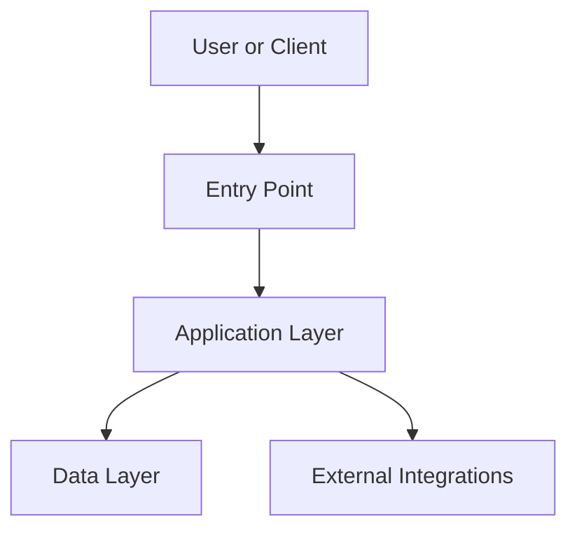

# {{APPLICATION_NAME}} - Architecture Overview

> **Owner Role:** Documentation Lead
> **Date:** {{DATE}}
> **Status:** {{STATUS}}
> **Source Artifacts:** {{SOURCE_ARTIFACTS}}

## System Purpose

- {{PRIMARY_PURPOSE}}
- {{PRIMARY_USERS}}
- {{PRIMARY_BUSINESS_CAPABILITIES}}

## Technology Stack

| Layer | Technology | Version | Purpose |
|-------|------------|---------|---------|
| Backend | {{BACKEND_TECH}} | {{BACKEND_VERSION}} | {{BACKEND_PURPOSE}} |
| Frontend | {{FRONTEND_TECH}} | {{FRONTEND_VERSION}} | {{FRONTEND_PURPOSE}} |
| Data | {{DATA_TECH}} | {{DATA_VERSION}} | {{DATA_PURPOSE}} |
| Hosting | {{HOSTING_TECH}} | {{HOSTING_VERSION}} | {{HOSTING_PURPOSE}} |

## High-Level Architecture

Describe the main components, boundaries, data flow, and trust boundaries.

## Major Components

| Component | Location | Responsibility | Notes |
|-----------|----------|----------------|-------|
| {{COMPONENT_1}} | {{PATH_1}} | {{RESPONSIBILITY_1}} | {{NOTES_1}} |

## Key Flows

1. {{FLOW_1}}
2. {{FLOW_2}}
3. {{FLOW_3}}

## Risks and Constraints

- {{RISK_OR_CONSTRAINT_1}}
- {{RISK_OR_CONSTRAINT_2}}
