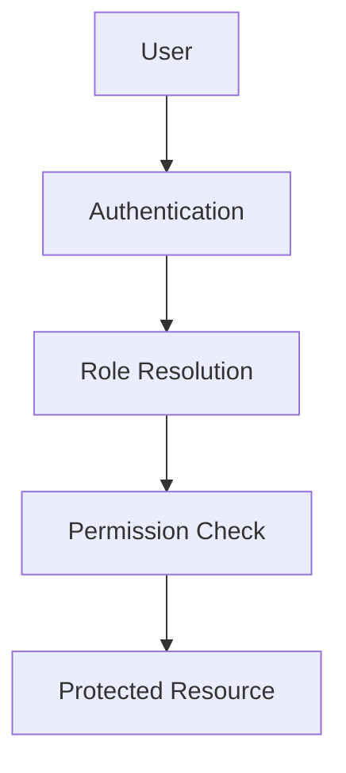

# {{APPLICATION_NAME}} - Permissions and Roles

> **Owner Role:** Business Analyst
> **Date:** {{DATE}}
> **Status:** {{STATUS}}

## Access Model

Summarize how identities, roles, permissions, and exceptions are implemented.

## Role Matrix

| Role | Can View | Can Edit | Can Approve | Special Constraints |
|------|----------|----------|-------------|---------------------|
| {{ROLE}} | {{VIEW}} | {{EDIT}} | {{APPROVE}} | {{CONSTRAINTS}} |

## Gaps and Exceptions

- {{ACCESS_GAP_1}}
- {{ACCESS_EXCEPTION_1}}
