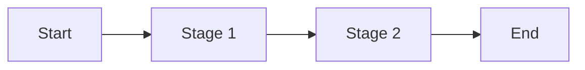

# {{APPLICATION_NAME}} - Primary Workflow

> **Owner Role:** Business Analyst
> **Date:** {{DATE}}
> **Status:** {{STATUS}}

## Workflow Summary

Describe the application's primary end-to-end lifecycle.

## Stages

| Stage | Entry Conditions | User Actions | System Actions | Exit Conditions |
|-------|------------------|--------------|----------------|-----------------|
| {{STAGE}} | {{ENTRY}} | {{USER_ACTIONS}} | {{SYSTEM_ACTIONS}} | {{EXIT}} |

## Exceptions

- {{EXCEPTION_1}}
