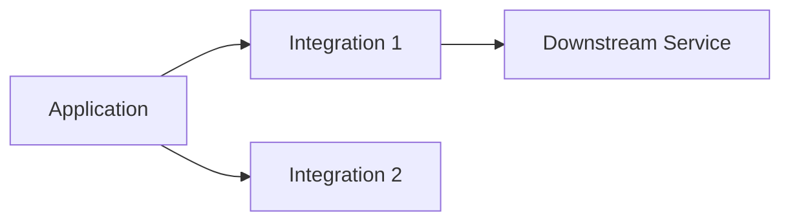

# {{APPLICATION_NAME}} - External Integrations

> **Owner Role:** Legacy Code Analyst
> **Date:** {{DATE}}
> **Status:** {{STATUS}}

## Integration Diagram

## Integration Inventory

| Integration | Direction | Purpose | Authentication | Failure Mode | Owner |
|-------------|-----------|---------|----------------|--------------|-------|
| {{INTEGRATION}} | {{DIRECTION}} | {{PURPOSE}} | {{AUTH}} | {{FAILURE_MODE}} | {{OWNER}} |

## Operational Notes

- {{INTEGRATION_NOTE_1}}
