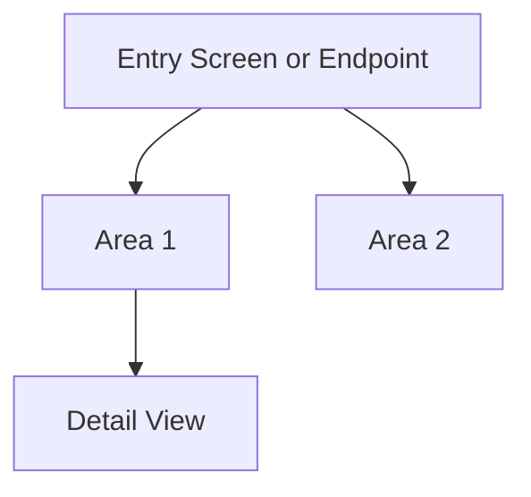

# {{APPLICATION_NAME}} - Screen Flow and Navigation

> **Owner Role:** Documentation Lead
> **Date:** {{DATE}}
> **Status:** {{STATUS}}
> **Note:** If the application is not UI-based, repurpose this file for endpoint or workflow navigation.

## Navigation Model

Summarize how users move through the system.

## Screen or Endpoint Map

| Screen or Endpoint | Entry Path | Purpose | Key Actions | Dependencies |
|--------------------|-----------|---------|-------------|--------------|
| {{SCREEN_OR_ENDPOINT}} | {{ENTRY_PATH}} | {{PURPOSE}} | {{KEY_ACTIONS}} | {{DEPENDENCIES}} |

## Notable Navigation Rules

- {{NAVIGATION_RULE_1}}
