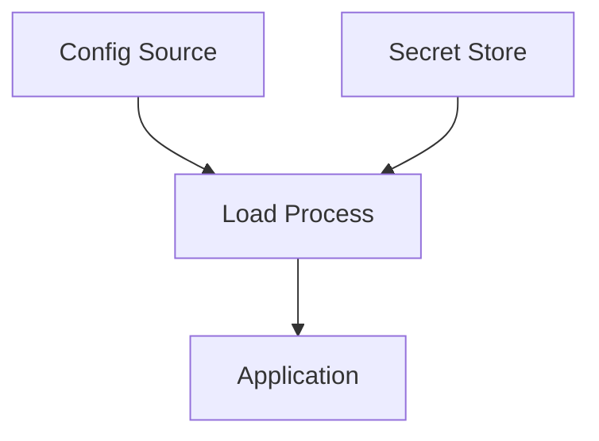

# {{APPLICATION_NAME}} - Configuration Reference

> **Owner Role:** Legacy Code Analyst
> **Date:** {{DATE}}
> **Status:** {{STATUS}}

## Configuration Flow

## Configuration Inventory

| Setting Area | Location | Environment Scope | Purpose | Sensitive | Notes |
|--------------|----------|-------------------|---------|-----------|-------|
| {{SETTING_AREA}} | {{LOCATION}} | {{ENV_SCOPE}} | {{PURPOSE}} | {{YES_NO}} | {{NOTES}} |

## Environment Differences

- {{ENVIRONMENT_DIFFERENCE_1}}

## Secret Handling Notes

- {{SECRET_BOUNDARY_1}}
