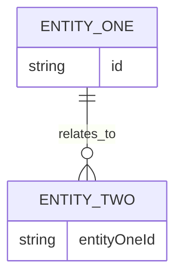

# {{APPLICATION_NAME}} - Entity Relationship Diagram

> **Owner Role:** Business Analyst
> **Date:** {{DATE}}
> **Status:** {{STATUS}}

## Diagram Scope

Describe which schemas, entities, or bounded contexts are represented.

## Relationship Notes

| Entity | Related Entity | Relationship | Notes |
|--------|----------------|--------------|-------|
| {{ENTITY}} | {{RELATED_ENTITY}} | {{RELATIONSHIP}} | {{NOTES}} |

## Diagram Placeholder

Add a Mermaid ER diagram here.

