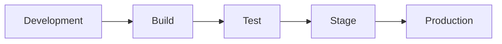

# {{APPLICATION_NAME}} - Deployment and Release Runbook

> **Owner Role:** Documentation Lead
> **Date:** {{DATE}}
> **Status:** {{STATUS}}

## Deployment Flow

1. {{DEPLOY_STEP_1}}
2. {{DEPLOY_STEP_2}}
3. {{DEPLOY_STEP_3}}

## Environment Matrix

| Environment | Purpose | Entry Point | Approvals | Notes |
|-------------|---------|-------------|-----------|-------|
| {{ENVIRONMENT}} | {{PURPOSE}} | {{ENTRY_POINT}} | {{APPROVALS}} | {{NOTES}} |

## Rollback Guidance

- {{ROLLBACK_STEP_1}}
- {{ROLLBACK_STEP_2}}

## Release Risks

- {{RELEASE_RISK_1}}
