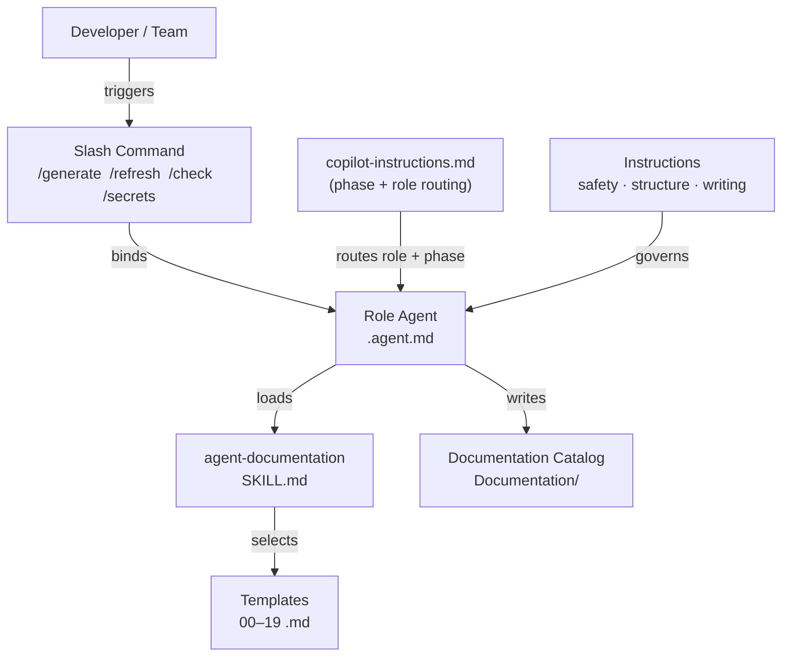

# Agentic Documentation

A portable VS Code Copilot customization package that delivers a **role-based, agent-driven documentation framework** for any application repository. Drop the `.github/` folder into a target repo and Copilot gains the skills, agents, prompts, and guardrails needed to generate, refresh, audit, and maintain a numbered application documentation catalog.

---

## What It Does

This repository ships a self-contained documentation automation kit. Once installed in any repository, it enables GitHub Copilot to:

- Generate a full **00–20 numbered documentation catalog** from source code, configuration, pipelines, and database artifacts in a single command.
- Refresh stale documents incrementally after code changes.
- Audit a catalog for missing files, placeholder gaps, metadata omissions, diagram coverage, and secret leakage.
- Scan documentation for exposed credentials.
- Apply specialized reasoning through **role-based agents** (architect, analyst, QA engineer, risk reviewer, refactoring planner, and more).
- Enforce **read-only documentation mode** to ensure documentation tasks never mutate application source code, tests, or runtime configuration.

---

## Repository Layout

```text
.github/
  copilot-instructions.md       # Phase switch, role routing, and documentation standards
  agents/                       # Role-based .agent.md files
  instructions/                 # .instructions.md files (safety, structure, writing)
  prompts/                      # Slash-command .prompt.md files
  skills/
    agent-documentation/
      SKILL.md                  # Skill definition loaded by Copilot
      README.md                 # Asset layout and usage notes
      templates/
        agent-documentation/    # 20 numbered Markdown templates (00–19 + README)
      examples/
        agent-role-map.md       # Quick agent selection reference
.vscode/
  settings.json                 # Workspace color theme (Peacock)
```

---

## Key Components

### Phase Switch — `copilot-instructions.md`

The root instruction file contains a single-line phase indicator:

```
CURRENT PHASE: documentation   (or)   implementation
```

| Phase            | Behavior                                                                                                  |
| ---------------- | --------------------------------------------------------------------------------------------------------- |
| `documentation`  | All documentation work is read-only. Source code, tests, pipelines, and configuration may not be changed. |
| `implementation` | Normal coding, refactoring, and feature work are permitted alongside documentation updates.               |

Secret-handling rules apply in both phases. Credentials are never written into any file.

---

### Agents — `.github/agents/`

Eleven role-based agent definitions give Copilot a specialized persona and working style for each documentation concern.

| Agent File                                 | Role                | Primary Responsibility                                                            |
| ------------------------------------------ | ------------------- | --------------------------------------------------------------------------------- |
| `documentation-lead.agent.md`              | Documentation Lead  | Architecture overviews, onboarding guides, deployment runbooks, catalog coherence |
| `business-analyst.agent.md`                | Business Analyst    | Business rules, workflows, permissions, reports, glossary                         |
| `qa-engineer.agent.md`                     | QA Engineer         | Test plans, validation matrices, regression checklists                            |
| `legacy-code-analyst.agent.md`             | Legacy Code Analyst | Technical debt, operational risk, troubleshooting, integrations, security         |
| `refactoring-planner.agent.md`             | Refactoring Planner | Phased modernization plans, safe-change sequencing                                |
| `session-logger.agent.md`                  | Session Logger      | Session log maintenance, decision chronology, open questions                      |
| `work-monitor.agent.md`                    | Work Monitor        | Task breakdown, backlog tracking, progress monitoring                             |
| `documentation-catalog-generator.agent.md` | Catalog Generator   | Full 00–20 catalog creation in a single autopilot run                             |
| `documentation-catalog-refresher.agent.md` | Catalog Refresher   | Incremental updates to an existing catalog                                        |
| `documentation-catalog-validator.agent.md` | Catalog Validator   | Completeness audits, metadata checks, secret hygiene                              |
| `documentation-secret-scanner.agent.md`    | Secret Scanner      | Focused credential and secret leakage scan across documentation                   |

---

### Instructions — `.github/instructions/`

Three instruction files are applied automatically to documentation assets under `Documentation/` or `docs/`.

| File                                      | Purpose                                                                                                                           |
| ----------------------------------------- | --------------------------------------------------------------------------------------------------------------------------------- |
| `documentation-safety.instructions.md`    | Enforces read-only scope; prohibits secrets in any documentation output                                                           |
| `documentation-structure.instructions.md` | Mandates the 00–19 numbered catalog structure and catalog README upkeep                                                           |
| `documentation-writing.instructions.md`   | Writing standards: evidence-driven prose, tables for inventories, Mermaid for all diagrams, explicit labeling of inferred content |

---

### Prompts (Slash Commands) — `.github/prompts/`

| Command                                    | Bound Agent       | Effect                                                                 |
| ------------------------------------------ | ----------------- | ---------------------------------------------------------------------- |
| `/generate-documentation-catalog [folder]` | Catalog Generator | Creates the full 00–19 catalog from scratch using repository evidence  |
| `/refresh-documentation-catalog [folder]`  | Catalog Refresher | Updates stale or incomplete documents in an existing catalog           |
| `/check-documentation-catalog [folder]`    | Catalog Validator | Audits catalog for missing files, stale placeholders, and Mermaid gaps |
| `/check-documentation-secrets [folder]`    | Secret Scanner    | Scans documentation for exposed credentials or sensitive values        |

Default documentation folder: `Documentation`.

---

### Skill — `.github/skills/agent-documentation/`

The `SKILL.md` file defines the `agent-documentation` skill. Copilot loads this skill when documentation catalog work is requested, and it governs:

- which templates to use for missing documents
- which role agent to apply per document type
- safety and quality rules for the output

#### Template Set — `templates/agent-documentation/`

Twenty reusable Markdown templates cover the full 00–19 catalog structure.

| #   | Template File                          | Owner Role          |
| --- | -------------------------------------- | ------------------- |
| —   | `README.md`                            | Documentation Lead  |
| 00  | `00-Architecture-Overview.md`          | Documentation Lead  |
| 01  | `01-Business-Rules.md`                 | Business Analyst    |
| 02  | `02-QA-Test-Plan.md`                   | QA Engineer         |
| 03  | `03-Technical-Debt-and-Risks.md`       | Legacy Code Analyst |
| 04  | `04-Refactoring-Plan.md`               | Refactoring Planner |
| 05  | `05-Troubleshooting-Playbook.md`       | Legacy Code Analyst |
| 06  | `06-Data-Dictionary.md`                | Business Analyst    |
| 07  | `07-Permissions-and-Roles.md`          | Business Analyst    |
| 08  | `08-Primary-Workflow.md`               | Business Analyst    |
| 09  | `09-External-Integrations.md`          | Legacy Code Analyst |
| 10  | `10-Stored-Procedure-Reference.md`     | Legacy Code Analyst |
| 11  | `11-Onboarding-Guide.md`               | Documentation Lead  |
| 12  | `12-Screen-Flow-and-Navigation.md`     | Documentation Lead  |
| 13  | `13-Configuration-Reference.md`        | Legacy Code Analyst |
| 14  | `14-Glossary-and-Domain-Model.md`      | Business Analyst    |
| 15  | `15-Security-Remediation-Checklist.md` | Legacy Code Analyst |
| 16  | `16-Entity-Relationship-Diagram.md`    | Business Analyst    |
| 17  | `17-Deployment-and-Release-Runbook.md` | Documentation Lead  |
| 18  | `18-Feature-Configuration-Guide.md`    | Business Analyst    |
| 19  | `19-Report-Catalog.md`                 | Business Analyst    |
| 20  | `20-Session-Log.md`                    | Session Logger      |

---

## How the Components Interact



---

## Using This Package in Another Repository

1. Copy the `.github/` folder into the target repository root.
2. Open the repository in VS Code with GitHub Copilot enabled.
3. Run `/generate-documentation-catalog` in Copilot Chat to produce the full catalog.
4. Use role agents directly (e.g., `@legacy-code-analyst`) for focused documentation tasks.
5. Run `/check-documentation-catalog` to validate catalog completeness and quality.

---

## Safety Guarantees

- Documentation mode is **read-only** for application artifacts. Source code, tests, pipelines, database scripts, infrastructure definitions, and runtime configuration are never modified during a documentation task.
- Secrets, passwords, API keys, tokens, certificates, private keys, and credential-bearing connection strings are **never written into documentation**. When a credential dependency must be described, only its type, source location, and owning component are recorded.
- If a secret exposure is discovered during documentation work, the risk is documented in generalized terms without reproducing the secret value.

---

## Design Goals

- **Portable** — the entire kit is self-contained under `.github/` and can be copied into any repository with no external dependencies.
- **Agent-neutral naming** — generic role names (`documentation-lead`, `business-analyst`, etc.) allow teams to apply their own personas or aliases without changing behavior.
- **Stable numbering** — the 00–19 catalog structure is consistent across repositories so catalogs are comparable and cross-navigable.
- **Evidence-driven** — agents are instructed to derive documentation from observable code, configuration, and pipeline artifacts rather than assumptions. Inferred content is explicitly labeled.
- **Mermaid-first** — all diagrams are authored in Mermaid. Screenshots and external binaries are not used as primary documentation artifacts.
